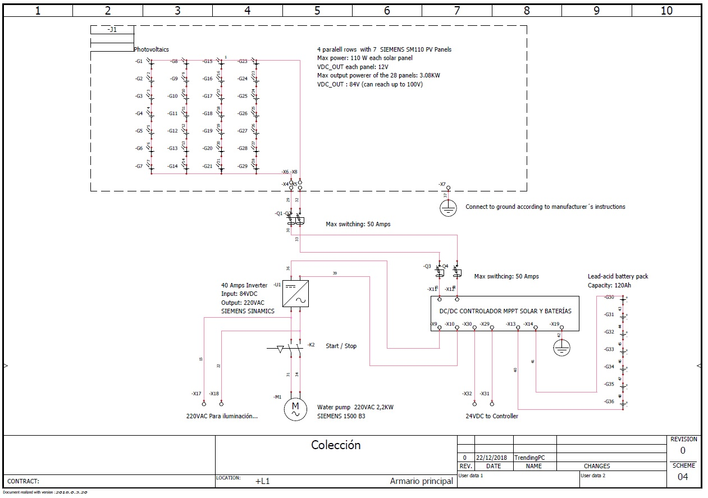

# Auara_project for the development of solar water pumps  (IMH Elgoibar)

700 Million people lack adequate access to safe water. Solar water pumps 
can help, feel free to hack this project.

## Table of Contents

* [Read this first](#read-this-first)
* [Usage](#usage)
  * [License and acknowledgement](#license)
    * [Electrical diagram](#electrical-diagram)
    * [Mechanical 3D design](#mechanical-3d-design)
    * [Microcontroller firmware](#microcontroller-firmware)
* [Browser Support](#browser-support)

## Read this first

*In drought-affected areas of Kenya, women must walk miles to find water, risking violence or animal 
attack, in order to sustain their families and animals. They do this with the knowledge that the dirty 
water they have collected may well make their children very ill.

Using the overabundance of sunshine, the solar pump draws water from a 100-metre-deep well, providing 
families with the water that they desperately need and rendering cases of water-related diseases a 
thing of the past.

* If you have an idea for a new feature, **submit your feature
  requests** to the [specification's repository](https://github.com/iarakistain/Auara_project/issues).
  

## Usage

For a more comprehensive reference, refer to
https://github.com/iarakistain/Auara_project

### License and acknowledgement

This project is released as Open Source, with Creative Commons, 
Share Alike license. Feel free to modify and improve it. Commercial
use is not allowed. 

In case you use it, please acknowleded IMH Institute. 

#### Electrical diagram

We have used mostly, components from SIEMENS in our design. 

#### Mechanical 3D design

STL design file is included.

#### Microcontroller firmware

The code has been developed for a STM32 microcontroller, using ARDUINO.

## Browser Support

- Chrome
- Firefox
- Safari 6.1+
- Internet Explorer 10+

Note: modern browsers such as Chrome, Firefox, Microsoft Edge, and Safari contain native
implementations of `window.fetch`, therefore the code from this polyfill doesn't
have any effect on those browsers. If you believe you've encountered an error
with how `window.fetch` is implemented in any of these browsers, you should file
an issue with that browser vendor instead of this project.

  [fetch specification]: https://fetch.spec.whatwg.org
  [cors]: https://developer.mozilla.org/en-US/docs/Web/HTTP/Access_control_CORS
    "Cross-origin resource sharing"
  [csrf]: https://www.owasp.org/index.php/Cross-Site_Request_Forgery_(CSRF)_Prevention_Cheat_Sheet
    "Cross-site request forgery"
  [forbidden header name]: https://developer.mozilla.org/en-US/docs/Glossary/Forbidden_header_name
  [releases]: https://github.com/github/fetch/releases
